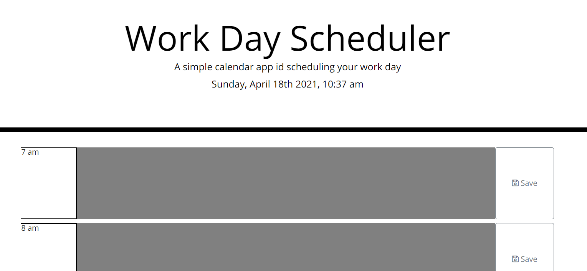
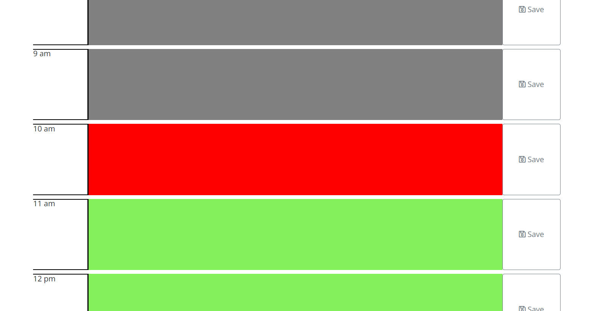
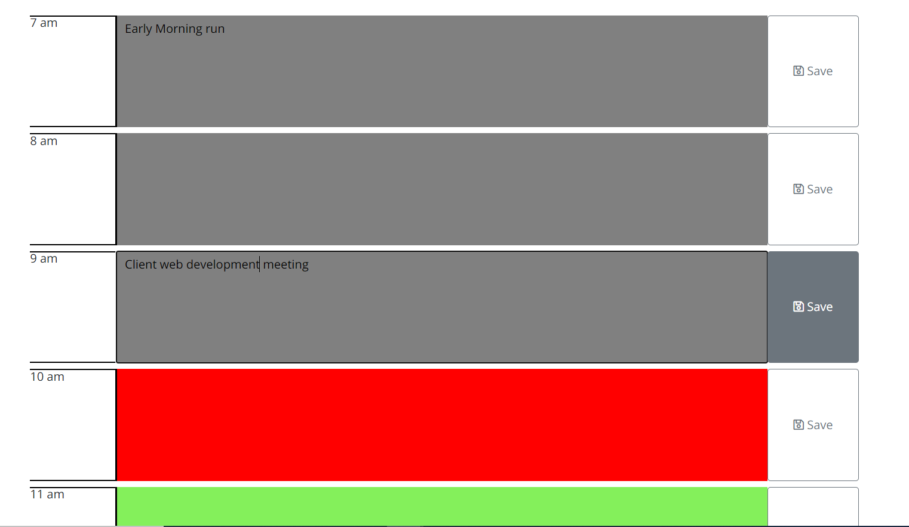
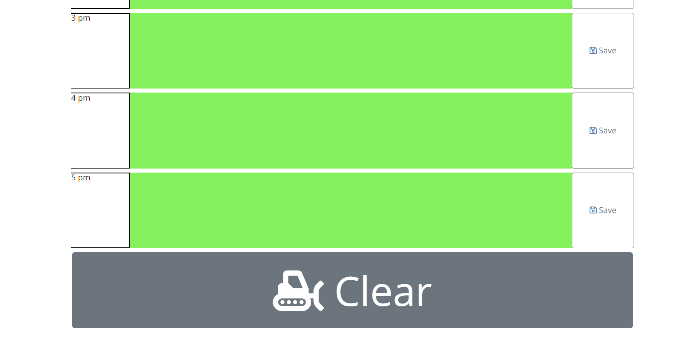

# Day-Planner
<h1 align="center">Simple Day Planner</h1>

<h2>Day Planner Scope</h2>

This planner is designed to assist people with a busy schedule, it has text boxes for each hour of the standard work day that the user can populate with unique information, this information is then saved to that text box and even if the page is reloaded or left it is retained, only when the user presses the clear button is the inforation cleared

<h2>Deployed links</h2>
<h3>https://yurikitchin.github.io/Day-Planner/</h3>
<h3>https://github.com/yurikitchin/Day-Planner</h3>

<h2 align="center">Main Functions</h2>

 this app uses a third party API "moment" to determine the day, date and time which is then displayed on to the title section of the page 

this app also colour coded, showing the current hour you are in as red, past hours of the day are grey, and the hours to come are shown in green

once the user enters their desired text into the text field, they are then able to press the save button, which saves this information to local storage, this information is then displayed whenever the user opens this page. This information can be updated or written over without affecting the information in the other text areas 

if the user wants to reset the information displayed, there is a clear button at the bottom of the screen that clears and values save to the local storage, ready for the user to repopulate. 

